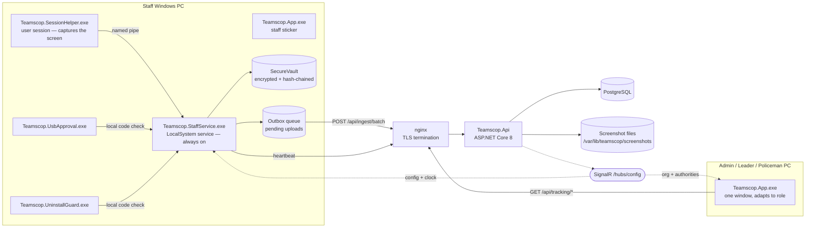

# 03 — Architecture

## Runtime topology



## Process topology on a staff PC

| Process | Runs as | Purpose |
|---|---|---|
| `Teamscop.StaffService.exe` | LocalSystem service | Always-on coordinator: vault, outbox, sync, heartbeat, USB policy, named-pipe server |
| `Teamscop.SessionHelper.exe` | Logged-in user | The only process that can capture the screen. Windows session isolation prevents a session-0 service from doing it |
| `Teamscop.App.exe` | Logged-in user | The staff sticker; also the full console for leaders and policemen |
| `Teamscop.UsbApproval.exe` | Logged-in user | Sticker shown when a USB device is inserted |
| `Teamscop.UninstallGuard.exe` | Elevated, during uninstall | Sticker that collects the uninstall approval code |

The service and the helper communicate over a named pipe carrying length-prefixed UTF-8 JSON.

## Project dependency graph

```
Engine.Auth  ←  Engine.Lifecycle  ←  Engine.Sync  ←  Engine.Tracking
                                  ←  Engine.Usb

StaffService  →  Tracking, Usb, Sync, Lifecycle, Auth
SessionHelper →  Tracking
App           →  Tracking, Lifecycle, Auth
Setup         →  (standalone)
Api           →  Auth, Lifecycle, Sync, Tracking   ← for shared DTOs and crypto
```

The graph is acyclic. The API references four agent libraries so that the wire contract has exactly
one implementation on both sides: the ingest and tracking DTOs and the event-type allowlist
(`Engine.Sync`), the company-token codec (`Engine.Auth`), and the TOTP generator plus the authority
package ids (`Engine.Lifecycle`). This guarantees contract fidelity but pulls Windows-oriented
dependencies from `Engine.Tracking` — `System.Drawing.Common`, `Microsoft.Data.Sqlite`, the SignalR
*client* — into the server's publish output.

The **business clock is the one thing that is not shared**: the server owns
`Teamscop.Api/Services/CompanyBusinessTime.cs` and the agent owns
`Engine.Tracking/BusinessClock.cs`. Since §8.4 reduced the clock to a timezone id this is a small
duplication, but it is a duplication — a change to zone resolution has to be made twice.

All engine libraries target portable `net8.0`; Windows-only behaviour is gated at runtime by
`OperatingSystem.IsWindows()` so the solution still builds and tests on Linux CI.

## End-to-end flows

### Enrollment

1. Admin signs up → server creates a company and returns an encrypted company token (`TS1.…`)
2. Employee runs `Teamscop_setup.exe`, pastes the token
3. Agent derives a `deviceKey` from hardware serials
4. Agent posts staff signup with device key + token → server validates and returns an access token
5. Server writes a synthetic `registration` event
6. Agent stores its state locally and starts collecting

### Capture → upload → view

1. `SessionHelper` samples time-track state, captures displays, and reads Chrome history
2. Records are sent over the named pipe to the service
3. The service appends each record to the **vault** (compressed, encrypted, hash-chained)
4. The record is enqueued into the **outbox** as a file
5. `SyncEngine` batches pending items and posts them to `/api/ingest/batch`
6. The server validates, deduplicates, extracts screenshot images to the filesystem, denormalizes
   the timetrack window onto the row, anchors the vault sequence against the chain hash it already
   holds, and stores the event
7. The desktop app queries `/api/tracking/*` and renders

Timestamps are stored as **real UTC instants only**. Company-local time is computed at read time
from `OccurredAt` plus the company's timezone — nothing writes a wall clock to the database. See
[04-DATA-MODEL](04-DATA-MODEL.md).

### Configuration push

1. Admin changes a staff member's tracking settings in the app
2. `PUT /api/tracking/config/{staffUserId}` → version bumped
3. Server pushes `TrackingConfigUpdated` over SignalR to that staff member's group
4. The service applies it and forwards it to the session helper over the pipe

The service also **pulls** configuration over HTTP on its own clock (`Agent:ConfigPullSeconds`,
default 180 s, floor 30 s), deliberately not conditioned on the hub — SignalR is a latency
optimisation, not the delivery mechanism. If the hub is unreachable, configuration still arrives.

### USB approval

1. Device watcher detects an inserted removable device
2. The device is blocked — it must not appear in the PC at all
3. `Teamscop.UsbApproval.exe` shows a sticker with a 6-digit input
4. Employee obtains the code from the admin out of band and types it
5. The agent **verifies the code locally** (works offline)
6. On success the block lifts for that specific device until it is removed
7. A `usb_event` record is written for the audit trail

### Uninstall

1. User runs `Teamscop_setup.exe /uninstall` (elevated)
2. Setup detects this is a staff machine via the SCM service and an HKLM marker
3. `Teamscop.UninstallGuard.exe` shows a sticker requesting the code
4. Code is verified; on success the uninstall proceeds and an `uninstall` event is recorded
5. On failure or cancellation, **nothing is removed**

## Server composition

`Program.cs` is the whole composition root: options binding with fail-fast validation, provider
selection, JWT bearer authentication, three rate-limit policies, one exception middleware, static
file serving for avatars, migration on startup, and seven endpoint modules (eight route groups) plus
`/health` and one SignalR hub.

There are no controllers. Every endpoint is a minimal-API handler that resolves the caller and calls
exactly one service; **it does not map exceptions** — `ExceptionHandlingMiddleware` is the single
place an exception becomes a status code, and endpoint handlers carry no `try`/`catch` except the
four credential checks documented in [05-API](05-API.md).

All authorization decisions live in the service layer. The chokepoint is `IAccessPolicy`, which
loads one `ViewerContext` per user per request and answers every question from it as a pure
function, with `IStaffDataGuard` composing the two-step "may this viewer see this staff member, and
may they see this kind of data" check that every read-side service performs.

## Design principles

1. **Service-layer authorization.** Endpoints are thin; `IAccessPolicy` decides everything.
   Tenant isolation is enforced by comparing the caller's `CompanyId` to the target's.
2. **Shared contract libraries.** The API and the agent share DTO and crypto code so they cannot
   drift apart.
3. **Local durability first.** Everything is written to the vault and outbox before upload, so a
   network outage never loses data.
4. **Offline-capable approvals.** USB and uninstall codes verify on the machine, not the server.
5. **Keep the logic simple.** Edge cases the owner has ruled out — employee lifecycle, multi-tenant
   timezones, multi-device rollup — must not be built.
