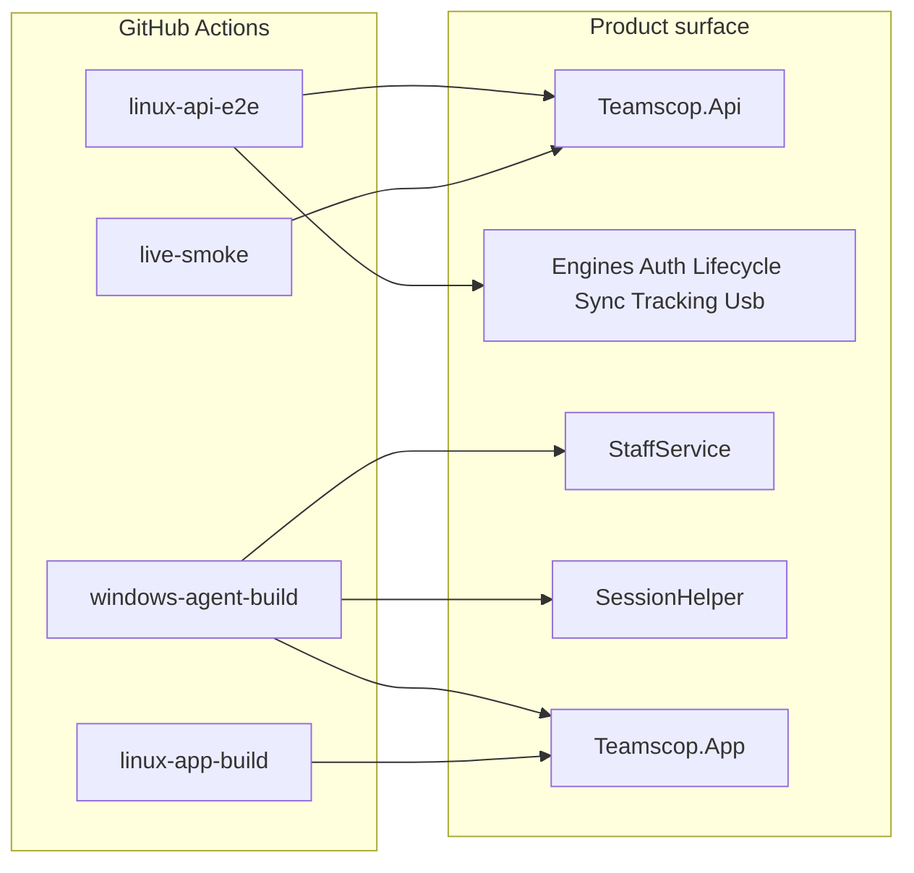

# Teamscop — E2E CI/CD Plan

Dedicated plan for continuous integration and end-to-end verification of **all engines, API, agent hosts, and Avalonia UI builds** on GitHub Actions.

Workflow file: [`.github/workflows/e2e.yml`](../.github/workflows/e2e.yml)  
Repo: `https://github.com/xenosie/teamscop`

---

## Goals

| Goal | How CI enforces it |
|------|--------------------|
| Every PR/push is green before merge | `E2E` workflow on `push` / `pull_request` / `workflow_dispatch` |
| Engines stay portable | Linux restore/build/test of full solution |
| Windows agent hosts compile | Windows job builds StaffService, SessionHelper, App, UsbApproval, UninstallGuard, AdminHost |
| API contracts stay honest | `Teamscop.Api.Tests` (WebApplicationFactory) — auth, lifecycle, ingest, teams, police, chain, self-ban, USB, business time, app history |
| Live production not broken | Optional/main `live-smoke` against `https://teamscop.com` |
| No secrets in git | Tokens only via GitHub Actions / local `gh` auth — never committed |

---

## Architecture under test



---

## Job matrix

### 1. `linux-api-e2e` (ubuntu-latest) — primary gate

| Step | Command / check |
|------|-----------------|
| Restore | `dotnet restore Teamscop.sln` |
| Build | `dotnet build Teamscop.sln -c Release` |
| Test | `dotnet test Teamscop.sln -c Release` with TRX + coverage |
| Artifacts | `**/TestResults/**` |

**Coverage (tests in `backend/Teamscop.Api.Tests`):**

| Area | Representative tests |
|------|----------------------|
| Auth | `AuthFlowTests`, `CompanyTokenCodecTests`, `PasswordHasherTests`, `Jwt` via flows |
| Lifecycle / TOTP / USB | `LifecycleFlowTests`, `TotpGeneratorTests`, `UsbSessionControllerTests` |
| Sync / vault / ingest | `SyncEngineTests`, `SecureVaultTests`, `IngestFlowTests`, `EndToEndFlowTests` |
| Business time | `BusinessTimeTests` |
| Teams / org | `TeamOrgFlowTests` |
| Police / packages | `PoliceAuthorityFlowTests` |
| Self-monitoring ban | `SelfMonitoringBanTests` |
| Self timetrack sticker API | `StaffSelfTimeTrackTests` |
| Chain health | `ChainHealthFlowTests` |
| App history / broken | `AppHistoryFlowTests`, `AppHistoryFilterTests`, `AppBrokenWatchdogTests`, `PowerOffEmitterTests` |
| SignalR hub JWT | `ConfigHubAuthTests` |

### 2. `windows-agent-build` (windows-latest) — agent + UI compile

Builds (Release):

- `Teamscop.StaffService`
- `Teamscop.SessionHelper`
- `Teamscop.App` (Avalonia)
- `Teamscop.AdminHost`
- `Teamscop.UsbApproval`
- `Teamscop.UninstallGuard`
- Engines: Tracking, Usb, Sync, Lifecycle, Auth

Re-runs `Teamscop.Api.Tests` on Windows for OS-sensitive engine paths (vault paths, USB stubs).

Publishes a dry-run staff layout (`dotnet publish` Service + SessionHelper + App) to prove installer inputs compile.

### 3. `linux-app-build` (ubuntu-latest) — Avalonia UI compile

- `dotnet build agent/Teamscop.App/Teamscop.App.csproj -c Release`
- Ensures AXAML compile (role shells, sticker, chain banner, settings) on Linux preview target

**UI runtime automation** (click paths, sticker drag) is **not** in Actions yet — requires display/session. Manual / CRD checklist remains in [`UI_DEV_PREVIEW.md`](UI_DEV_PREVIEW.md) and [`deploy/windows/INSTALLER.md`](../deploy/windows/INSTALLER.md) smoke section.

### 4. `live-smoke` (ubuntu-latest) — production API

Runs on `workflow_dispatch` and `push` to `main`.

| Check | Endpoint / action |
|-------|-------------------|
| Health | `GET /health` |
| Admin signup | `POST /api/auth/admin/signup` |
| Staff signup | `POST /api/auth/staff/signup` |
| Tracking config | `PUT /api/tracking/config/{id}` + `GET .../config/me` |
| Police me | `GET /api/police/me` |
| Chain health (admin→staff) | `GET /api/tracking/chain/{staffId}` |
| Self chain forbidden | staff `GET /api/tracking/chain/{self}` → 403 |
| Self timetrack allowed | staff `GET /api/tracking/timetrack?staffUserId=self&from&to` → 200 |

Creates ephemeral CI users; does not delete (acceptable for smoke volume).

---

## Triggers & concurrency

| Event | Behavior |
|-------|----------|
| `push` to `main`/`master` | Full matrix + live-smoke |
| `pull_request` | Full matrix **without** live-smoke (no prod signup spam from forks) |
| `workflow_dispatch` | Full matrix + live-smoke |
| Concurrency | `e2e-${{ github.ref }}`, cancel-in-progress |

---

## Local parity

```bash
# Same as linux-api-e2e
dotnet restore Teamscop.sln
dotnet build Teamscop.sln -c Release
dotnet test Teamscop.sln -c Release

# App only
dotnet build agent/Teamscop.App/Teamscop.App.csproj -c Release

# Trigger remote CI without new commit
gh workflow run E2E
gh run watch
```

---

## Secrets & security

| Item | Policy |
|------|--------|
| GitHub PAT | **Never** commit. Use `gh auth` or Actions `GITHUB_TOKEN`. Rotate if pasted into chat/logs. |
| Production API | Live smoke uses public HTTPS; no admin password secrets required for signup smoke |
| Company token key | Test host uses Development config / in-memory; production key stays on VPS only |

---

## Expansion roadmap (post-v1)

1. **Avalonia UI smoke** on `windows-latest` with headless/framebuffer (auth window opens, role router resolves) — optional project `Teamscop.App.Tests`
2. **Staff installer CI** — run `publish-staff.ps1` artifact upload; WiX build when WiX is on the runner image
3. **SessionHelper pipe unit test** — in-process server/client round-trip in Api.Tests or a small Engine.Tracking test project
4. **Deploy job** — on tag `v*`, publish API artifact + document VPS pull (keep manual `systemctl` gate until approved)
5. **Required status check** — make `linux-api-e2e` required on `main` branch protection

---

## Definition of done for a green E2E run

- [ ] Solution builds Release on Linux
- [ ] All `Teamscop.Api.Tests` pass on Linux
- [ ] Windows builds Service + SessionHelper + App + stickers
- [ ] Linux builds Avalonia App
- [ ] On main/dispatch: live-smoke prints `LIVE_SMOKE_OK`
- [ ] Test TRX artifacts uploaded
